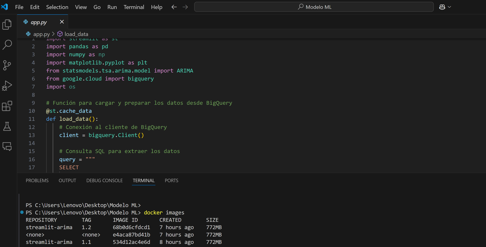
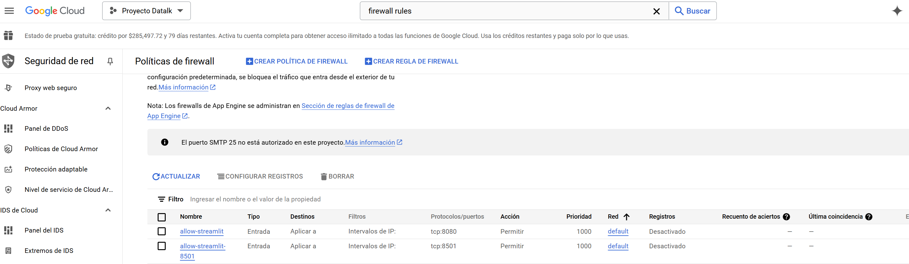
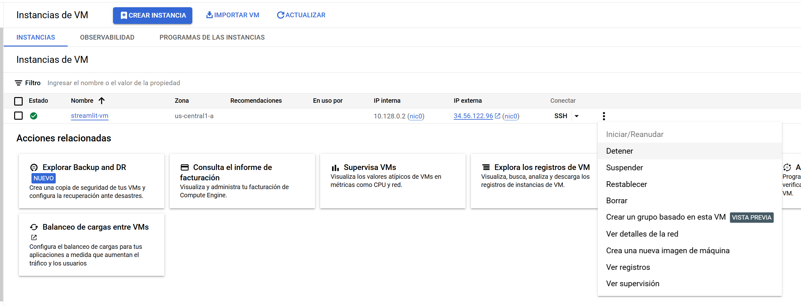
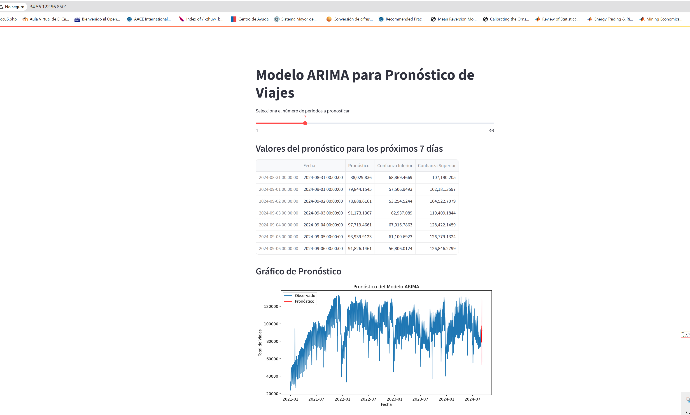
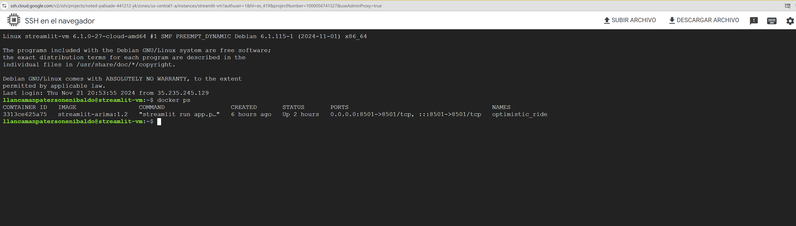

# Despliegue de la aplicación Streamlit con Docker en Google Cloud

## Objetivo 

El objetivo principal del modelo ARIMA es pronosticar la demanda de viajes en Taxi en la ciudad de Nueva York.
Las funcionalidades del modelo ARIMA permite visualizar el pronostico de viajes para los siguientes 30 días calendario con un intervalo de confianza y cuenta con un gráfico de la observacion y el pronóstico.
## 1. Requisitos previos
- **Estructura del proyecto**
**my_proyect/**
  - arima.py             # Archivo con el modelo ARIMA
  - requierements.txt    # Dependencias del proyecto
  - Dockerfile           # Archivo para construir la imagen Docker
  - .dockerignore        # Excluir archivos innecesarios
  - credentials.json     # Credenciales de Google BigQuery
  
- **Docker** instalado en la máquina local y en la VM.
- **Streamlit** instalado en el contenedor de Docker.
- **Google Cloud VM** creada y configurada.

## 2. Pasos realizados en el entorno local (Visual Studio Code)
### 2.1 Seguridad: Credenciales
Credenciales de Google Cloud: Asegúrate de que las credenciales (archivo JSON) sean manejadas de forma segura.


### 2.2 Crear la imagen de Docker
2.2.1. Creación del archivo `Dockerfile` con las siguientes especificaciones:
    ```dockerfile
    # Usa una imagen base con Python
    FROM python:3.9-slim

    # Establecer el directorio de trabajo
    WORKDIR /app

    # Copiar el archivo de la aplicación en el contenedor
    COPY . /app

    # Instalar las dependencias
    RUN pip install -r requirements.txt

    # Exponer el puerto que utilizará Streamlit
    EXPOSE 8501

    # Comando para ejecutar Streamlit
    CMD ["streamlit", "run", "app.py"]
    ```

### 2.2 Construcción de la imagen de Docker
2.2.1. Ejecutar el siguiente comando en la terminal de Visual Studio Code para construir la imagen Docker:
    ```bash
    docker build -t streamlit-arima .
    ```
<p align="center">
    
</p>


### 2.3 Exportar la imagen de Docker a un archivo .tar
2.3.1. Exportar la imagen Docker a un archivo `.tar`:
    ```bash
    docker save -o arima-streamlit.tar streamlit-arima
    ```
---

## 3. Pasos realizados en la máquina virtual de Google Cloud
### 3.1 Configurar regla de Firewall 

Para permitir el acceso al puerto 8501 de Streamlit en la máquina virtual de Google Cloud, es necesario configurar una regla de firewall. Sigue estos pasos: 
- Crear la regla 
- Verifica la regla : 
```bash
curl http://<VM_EXTERNAL_IP>:8501
```
Si no necesitas que la aplicación sea accesible desde cualquier IP, limita el rango de IPs de origen al de tu red local o usuarios autorizados.
<p align="center">
    
</p>

### 3.1 Subir la imagen Docker a la VM
3.1.1. Usar `scp` para subir el archivo `.tar` a la VM:
   
    ```bash
    scp streamlit-arima.tar <USER>@<VM_EXTERNAL_IP>:/home/<USER>/
    ```
<p align="center">
    
</p>

### 3.2 Cargar la imagen Docker en la VM
3.2.1. Cargar la imagen Docker desde el archivo `.tar`:
   
    ```bash
    docker load -i streamlit-arima.tar
    ```

### 3.3 Verificar que la imagen está disponible
3.3.1. Verificar que la imagen se cargó correctamente:
   
    ```bash
    docker images
    ```
3.3.2. Crear una IP estática: En el menú de la consola, ve a Red de VPC (VPC network) y selecciona Direcciones IP externas (External IP addresses).
Haz clic en el botón Reservar dirección IP estática y configurala.
```bash
gcloud compute instances describe <instance-name> --zone <zone>
```

### 3.4 Ejecutar el contenedor de Docker
3.4.1. Ejecutar el contenedor con el siguiente comando, se pasa también la variable de entorno al contenedor Docker al momento de ejecutarlo: (el puerto 8501 es mapeado para acceso a la aplicación Streamlit):
   
```bash
docker run -d -p 8501:8501 \
  -e GOOGLE_APPLICATION_CREDENTIALS=/app/credenciales.json \
  -v /ruta/a/credenciales.json:/app/credenciales.json \
  --name arima-streamlit-container streamlit-arima:1.2
``` 


### 3.5 Verificar que el contenedor está corriendo
3.5.1. Verificar que el contenedor está en ejecución:
   
    ```bash
    docker ps
    ```
    ---
### 3.6 Puebas y verificación:
   Verificar Logs del Contenedor: Instrucciones para consultar los logs en caso de errores:

```bash
docker logs streamlit-arima-container
```


   Algunos errores comunes estan relacionados con permisos que se deben otorgar en la base de datos y tabla a consultar en BigQuery, verificar el puerto en uso, versiones de las librerías que se deben instalar tanto en local como en la máquina virtual.

## 4. Acceso a la aplicación
4.1. Acceder a la aplicación Streamlit desde el navegador utilizando la IP pública de la máquina virtual de Google Cloud:

  **http://34.56.122.96:8501/**

<p align="center">
    
</p>

## 5. Configuración de Reinicio Automático del Contenedor Docker
5.1. Configuración de Reinicio Automático del Contenedor Docker al prender la máquina virtual se deploya streamlit automaticamente.
   
```bash
docker run -d --restart always -p 8501:8501 \
  --name arima-streamlit-container arima-streamlit:latest
```

<p align="center">
    
</p>

## 6. Consideraciones futuras:

**Escalabilidad:** Planes para escalar la aplicación utilizando balanceadores de carga o Kubernetes.

## 7. Referencias:
https://docs.docker.com/
https://docs.streamlit.io/
https://cloud.google.com/docs

## 8. Créditos:
**Diana Carolina Vallejo**
**Mirta Andrea Llancaman**
**Liz Mariana Henao Cardona**
**Nadia Scolese**
**Julian David Baquero Peña**
