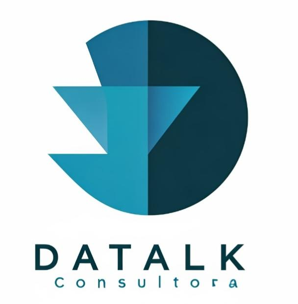
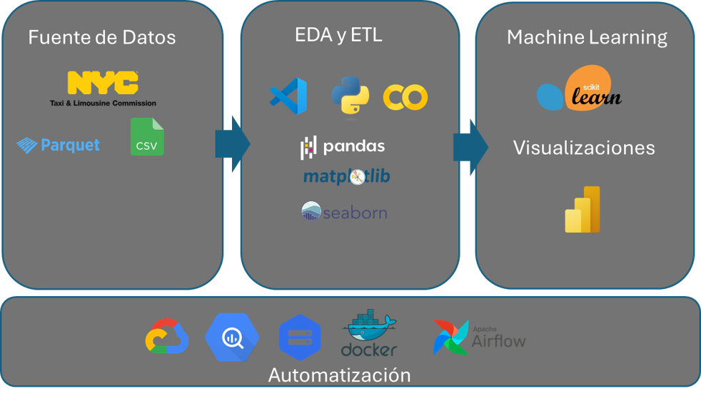

# Semana 1: Inicio Consultoría a empresa CityFlow

## 1. ¿Quienes Somos?:

    

En Datalk somos especialistas en transformar datos en conocimiento accionable, a través de soluciones personalizadas ,ayudamos a las organizaciones a optimizar sus procesos, mejorar la toma de decisiones y alcanzar sus objetivos estratégicos. Contamos con un equipo multidisciplinario de expertos en ciencia de datos, machine learning e inteligencia artificial,  además de ofrecer  un portafolio de servicios completo en cuanto a tratamiento de datos. (Pegar imagen equipo de trabajo)

## 2. Nuestro Cliente
La empresa de tecnología de transporte CityFlow está interesada en expandir su presencia en el mercado estadounidense, ingresando al mercado de transporte individual  en la Ciudad de Nueva York. Dicha empresa tiene un enfoque de sostenibilidad y cuidado del medio ambiente, además de brindar servicios de transporte eficiente, también pretende reducir la huella de carbono y contaminación auditiva en los mercados que opera , para además de asegurar la cobertura efectiva de la demanda, impactar positivamente en el medio ambiente.
La empresa solicita la consultoría para analizar los patrones de movilidad y las preferencias de los usuarios, en aras de generar una estrategia para ingresar a dicho mercado satisfaciendo la demanda de viajes individuales.

## 3. Alcance:
   - Realizaremos un análisis detallado de los datos del servicio de transporte individual en Nueva York durante el período 2021-2024 para estimar la demanda de servicios de taxis según la ubicación. 
   - El alcance de esta consultoría incluye el diseño e implementación de una solución tecnológica basada en datos para optimizar la operación del servicio de transporte individual, estimando la cantidad óptima de vehículos necesarios para satisfacer la demanda.

## 4. Objetivo General:
   - Diseñar una estrategia integral de consultoría para CityFlow, orientada a determinar la demanda de viajes individuales en la Ciudad de Nueva York.

## 5. Objetivos específicos:
   - Analizar la relación entre los servicios de taxis (verdes y amarillos) y variables ambientales como emisiones de CO2 y contaminación auditiva. 
   - Evaluar la huella de carbono y los niveles de contaminación auditiva en Nueva York para identificar el tipo de vehículo más adecuado para la situación ambiental actual de la ciudad.
   - Implementar un modelo de Machine Learning que pronostique la demanda futura.
   - Diseñar un dashboard interactivo que permita la visualización y comprensión de los datos para la toma de decisiones.
   - Proporcionar conclusiones y recomendaciones. 

## 6. Propuesta y entregables
  - Dashboard interactivo en línea que permita la visualización y análisis de datos del mercado de transorte individual de la ciudad de Nueva York.
  - Modelo de Machine Learning que pronostique la demanda.
  - 3 KPI's definidos y calculados. 

## 7. Definición de KPI's:

Seleccionamos los siguientes KPI para el proyecto, junto con sus fórmulas de cálculo:

- ### a. Incremento de la proporcionalidad de viajes en taxis ecológicos en el mercado 
  *Fórmula de cálculo:*

   - $\frac{PG_{t+1} - PG_t}{PG_t} > M$
   
   Donde: 
   - *PG* representa la proporción de viajes en taxi verde en un período específico.
   - *M* es la meta o umbral de crecimiento deseado.
   - *t* es el período actual.

- ### b. Mantener la tarifa promedio de viajes en los taxis ecológicos por debajo de la tarifa promedio de los taxis tradicionales, como un indicador direccionado a medir la competitividad
  

  *Fórmula de cálculo:* 

   - $\overline{TY}_t > \overline{TG}_t$

    Donde: 
   - $\overline{TY}_t$ representa la tarifa promedio de taxi tradicional (amarillo) en el período \( t \).
   - $\overline{TG}_t$ representa la tarifa promedio de taxi ecológico en el mismo período \( t \).

   ### c. Mantener la velocidad por debajo del promedio más la desviación estándar, como índice de seguridad vial y eficiencia en el recorrido del usuario
   
  *Fórmula de cálculo:* 

   - $M < \left( \overline{V} + SD_V \right)$  
   
   Donde:
   - $M representa el promedio de velocidad máximo permitido.
   - $\overline{V}$ es la velocidad promedio.
   - $SD_V$ es la desviación estándar de la velocidad.

 ## 8. Selección de Stack Tecnológico

Evaluamos y seleccionamos las herramientas, lenguajes de programación y plataformas que mejor se adaptarían a las necesidades del proyecto.

 ## 10. Metodología y Planificación:
   -  Metodología: Se utiliza SCRUM, un  marco de trabajo ágil, a través del cual un equipo pueden abordar problemas complejos a la vez que se entregan productos con el máximo valor. Es un enfoque más flexible e iterativo que permite responder y adaptarse continuamente al entorno para construir el mejor producto final para el cliente.

   

   -  Planificación: Se diseña un plan detallado mediante una carta Gantt que contempla las actividades futuras para los próximos sprints, teniendo en cuenta los plazos y recursos disponibles, ver [Carta Gantt Proyecto](https://docs.google.com/spreadsheets/d/11yBqjd7s70Lv_185qIlKuTaZCs_fcS_b/edit?rtpof=true).

## 9. Análisis EDA Inicial
  - En esta primera semana, realizamos un EDA utilizando datasets de muestra de los servicios de taxis amarillos y verdes, combinadas con datos de emisiones de CO2 y niveles de ruido, además de otras bases de datos relevantes para el cumplimiento de objetivos. 

# Resultados y conclusiones semana 1: 

Al finalizar la semana 1, logramos identificar claramente la problemática y establecer objetivos, alcances y entregables bien definidos. Con una comprensión sólida de los requerimientos y un plan detallado para las siguientes etapas, estamos preparados para avanzar hacia un análisis en profundidad en las próximas semanas.

